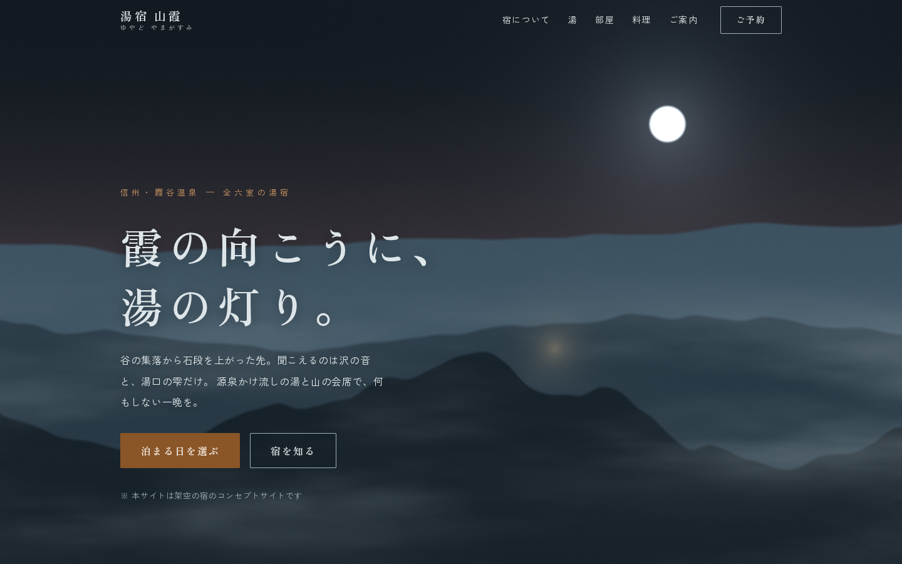

# 湯宿 山霞(ゆやど やまがすみ)

> **Concept Project** — 本サイトはフロントエンド制作の実績提示を目的とした架空の宿のコンセプトサイトです。「湯宿 山霞」は実在せず、掲載している住所・料金・泉質・献立はすべて架空の設定です。フォームからの送信は行われません。

架空の山あいの温泉旅館のブランドサイト。**Three.js等のライブラリを使わず、素のWebGL2と手書きGLSLシェーダー**で「霞・湯・灯り」を描く、没入型の1ページ構成レスポンシブサイトです。

ポートフォリオ3部作の3作目です:
[菓寮 月白](https://github.com/niwatory11/kario-tsukishiro)(世界観・情緒型)/ [常盤精工](https://github.com/niwatory11/tokiwa-seiko)(明快さ・信頼型)に対し、本作は**没入型(目的のあるWebGL表現)**の軸を実装しています。



## デザインコンセプト

**「霞の向こうに、湯の灯り。」**

このコピーをそのままシェーダーで実装しています。ヒーローの夜の谷はスクロールが進むほど霞が薄れ、山あいに宿の灯りがともります。ページを下る行為が「宿にたどり着く体験」になる構成です。

- **ヒーロー「山霞」**: 稜線3層・流れる霞・月と暈・星・宿の灯りを、すべてfbmノイズによる手続き生成で描画。スクロール(u_scroll)とポインタ視差(u_pointer)に反応
- **触れる露天風呂**: 波動方程式をピンポンFBOで解く水面シミュレーション。ポインタでなぞると波紋が広がり、無操作でも湯口の雫が周期的に水面を揺らす。月光(白)と灯り(橙)の2灯スペキュラ
- **湯けむり**: fbmノイズを疑似カールで歪ませた立ちのぼる蒸気(前乗算アルファで水面に重ねる)
- **配色**: 夜山・霞・生成り・灯火。没入の夜色面と、読むための生成り面を交互に構成
- **タイポグラフィ**: 見出しにZen Old Mincho、本文にZen角ゴシックNew

## WebGLの設計方針(目的のあるシェーダーだけ)

商業サイト調査の結論「没入型モーションは目的が明確な時のみ価値を持つ」に従い、シェーダーは世界観の題材(霞・湯・灯り)に限定しています。ガードも一式実装済みです:

- **WebGL2非対応** → CSSグラデーションの静的フォールバック(情報はすべてDOM側にあるため閲覧に支障なし)
- **`prefers-reduced-motion: reduce`** → 1フレームだけ描画して停止
- **画面外・タブ非表示** → IntersectionObserver / visibilitychange で描画ループを停止
- **devicePixelRatio上限**(ヒーロー2 / 水面1.5)と固定解像度シミュレーション(256²)で負荷を一定化
- 水面シミュレーションは固定120ステップ/秒とし、高リフレッシュレートでも速度と負荷を一定化
- float色バッファ非対応環境では水面シミュレーションのみ無効化(さざなみは動き続ける)

## 主な機能

- 固定ヘッダー(ヒーロー上は透過、スクロールで生成り地へ遷移)
- モバイルドロワーナビゲーション(フォーカストラップ・Escapeで閉じる・背面スクロールロック)
- 客室・料理・泉質などの情報セクション(すべてDOMテキストで完結)
- 宿泊予約フォーム(フロントエンドバリデーション)
  - チェックイン日は「翌日〜180日後」の境界検証、メール・電話形式
  - blur時+送信時の検証、エラーサマリーからの各項目リンク、完了表示へのフォーカス移動
- スキップリンク、セマンティックHTML、キーボード操作対応

## 技術構成

| 領域 | 採用技術 |
|---|---|
| フレームワーク | React 19 + TypeScript(strict) |
| ビルド | Vite 8(GLSLは `?raw` import) |
| 描画 | 素のWebGL2 + 手書きGLSL ×4本(3Dライブラリ不使用) |
| スタイル | CSS Modules + CSS Custom Properties(デザイントークン) |
| フォント | @fontsource(セルフホスト・unicode-rangeスライス配信、初期CSSから分離) |
| テスト | Vitest + Testing Library(25件) |
| lint | oxlint |

## セットアップ

```bash
npm install
npm run dev        # http://localhost:5173
```

## 開発コマンド

```bash
npm run lint       # oxlint
npm run typecheck  # tsc -b(TypeScript strict)
npm run test       # vitest(バリデーション・フォーム・ドロワー・スモーク)
npm run build      # 型チェック + production build(dist/)
npm run preview    # production buildの確認
```

## レスポンシブ対応

360 / 375 / 768 / 1024 / 1440px で表示確認済み(横スクロールなしを機械検査)。シェーダーcanvasは各画面幅で解像度を自動追従します。

## アクセシビリティ

- すべてのcanvasは装飾(`aria-hidden`)で、情報はDOM側に必ず存在
- ランドマークと `aria-labelledby` によるセクション構造、h1〜h3の正しい階層
- スキップリンク、`:focus-visible` のフォーカスリング(夜色面では灯火色に切替)
- ドロワーのフォーカストラップとフォーカス返却、フォーム完了表示へのフォーカス移動
- `prefers-reduced-motion: reduce` でシェーダーを含む全アニメーションを停止

## デプロイ

`main` ブランチへのpushで、GitHub Actions(`.github/workflows/deploy.yml`)がlint・テスト・buildを実行し、GitHub Pagesへ自動デプロイします。

- ライブデモ: https://niwatory11.github.io/yuyado-yamagasumi/
- サブパス配信のため `vite.config.ts` で `base: '/yuyado-yamagasumi/'` を設定済み

## ライセンス・注意

個人ポートフォリオ用のコンセプト作品です。文章・GLSLシェーダー・SVGは本リポジトリのために制作したものです。Webフォントの Zen Old Mincho / Zen Kaku Gothic New は第三者制作物で、SIL Open Font License 1.1 に基づき `@fontsource` パッケージから利用しています。
